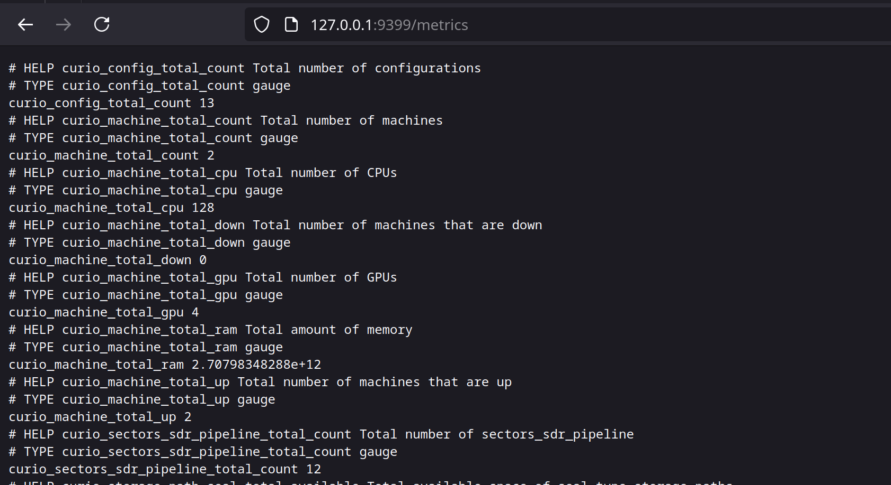
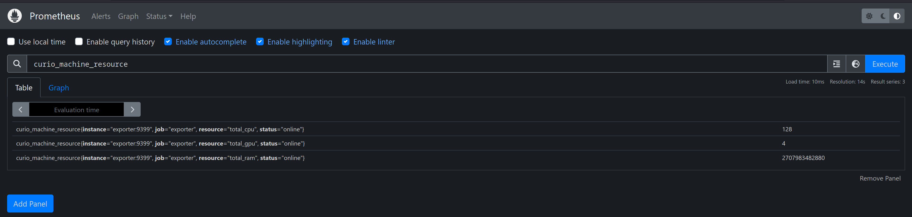

# curio-exporter
Prometheus exporter for curio cluster metrics.

All collectors can be found in the `collectors` directory.
## Usage

```shell
git clone https://github.com/web3tea/curio-exporter.git

cd curio-exporter

cp sql_exporter.yml.example sql_exporter.yml

# Edit sql_exporter.yml and update {data_source_name} with your database connection string
vim sql_exporter.yml

docker compose up -d

# Access http://localhost:9399/metrics for metrics
# Access http://localhost:9090 for prometheus
```

## Screenshots




